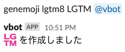

# genemoji slack bot



## setup

```bash
poetry install
cp .env.sample .env
vim .env
```

If you don't know how to set SLACK_COOKIE, please read [this link](https://github.com/smashwilson/slack-emojinator/blob/master/README.md).

## run local

```bash
poetry run uvicorn server:app --reload
ngrok http 8000
```
